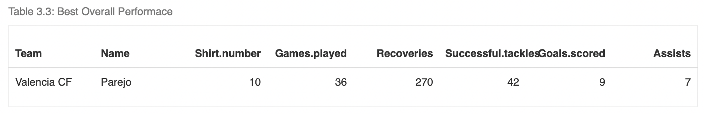

```{r setup, include=FALSE, echo=FALSE}
options(htmltools.dir.version = FALSE)
```


```{r echo=FALSE, message=FALSE, warning=FALSE}
library(tidyverse)
library(readr)
library(kableExtra)
La_liga_data <- read.csv("data/laliga_player_stats_english.csv")
```

class: left, top 

# Introduction

* La Liga is the Spanish football league and famous for it’s clubs like Real Madrid, Barcelona and Atlético Madrid. 

* The football leagues provide a great database for accurate statistics. 

* We are analyzing the data from the season 2019-2020.


```{r message=FALSE, echo=FALSE, warning=FALSE, out.width = '50%', fig.align='center'}

```

---
## Research Question 

* In our analysis we have found out the best players in every position ( Defender, Forward, Midfielder, Goalkeeper ). 
.content-box-soft[
* We have taken this data from [Kaggle](https://www.kaggle.com/datasets/thegreatcoder/laliga-player-stats).

* The data set contains variables like : Goals scored, Assists, Recoveries, Clearances etc.

* The data contains information about each and every player of the league. 
]
---

class: left, middle
# Defender position 


```{r out.width = '50%', echo = FALSE, fig.align="center"}
knitr::include_graphics("figs/position.png")
```

* In the sport of association football, a defender is an outfield player whose primary roles are to stop attacks during the game and prevent the opposing team from scoring goals.

* Center backs are usually in pairs, with two full-backs to their left and right, but can come in threes with no full backs.

---
class: left, middle

Two main important characteristics of a defender :
.content-box-soft[
* **Recovery**  - A recovery is recorded at the point where the player of the team beginning the possession touches the ball. 
]
.content-box-soft[
* **Clearance** - When a player kicks the ball away from the goal they are defending. 
]
.content-box-soft[
We will only analyze players who have played more than **50%** of the games, considering consistency is key factor for a 38 matches long league.
]


```{r out.width = '20%', echo = FALSE, fig.align="center"}
knitr::include_graphics("figs/logo.png")
```


---
class: left, middle
# Clearance Vs Recovery

* We will be analyzing the data to get the best defender by going through some levels.
* The first and major one being, plotting **Clearance Vs Recoveries** as the these are the two most important characteristics of a defender.


```{r out.width = '70%', echo = FALSE, fig.align="center"}
knitr::include_graphics("figs/CvsR.png")
```


---
class: left, middle
# Pique Vs Laguardia

* **Pique and Laguardia** came out on top in the first level as they had the most impact as a defender.
* Now we will try to choose the best defender by bringing in more variables into the picture. 


```{r out.width = '70%', echo = FALSE, fig.align="center"}

```


---
class: left, middle
# Who has made more mistakes?

* Now we will be judging the players on the number of mistakes made by them as they are giving each other a tough competition.

```{r out.width = '70%', echo = FALSE, fig.align="center"}

```

* As we can clearly see Laguardia has made significantly more mistakes while on the pitch, **Pique** is defender who wins this competetion.

* On top of of that pique has also scored 4 goals for .blue[FC] .red[BARCELONA]

---
class: center, middle
# Position: Forward

### The aim of this section is to analyse which player is the best in the *Forward position* in the LaLiga Tournament based on data from 2019-2020. 

.content-box-purple[
A Forward is an attacking player who plays nearest to the opposing team's goal and is most responsible for scoring goals for their team.
]
---
```{r Filter-Data, echo = FALSE}
Forward <- La_liga_data %>%
  filter (Position == "Forward")

Forward <- Forward %>%
  select(Team, Name, Games.played, Yellow.Cards, Goals.scored, Penalties.scored, Successful.tackles, Recoveries, Successful.duels, Assists, Interceptions, Recoveries, Successful.aerial.challenges) %>%
  rename("Games_played" = Games.played,
         "Yellow_cards" = Yellow.Cards,
         "Goals_scored" = Goals.scored,
         "Penalties_scored" = Penalties.scored,
         "Successful_tackles" = Successful.tackles,
         "Successful_duels" = Successful.duels,
         "Successful_aerial_challenges" = Successful.aerial.challenges)
```
## Analysis of goals, penalties and assists

Goals Scored, Penalties Scored and Assists account for the most successful outcome given by a player in the Forward position.

```{r Goals-Analysis, echo = FALSE, message=FALSE, warning=FALSE}
Forward <- Forward %>%
  mutate(goals_per_game = ((Goals_scored + Penalties_scored + Assists)/Games_played)) %>%
  arrange(desc(goals_per_game)) %>%
  mutate(Goal_rank = 1:94)

Forward_Goal <- Forward %>%
  slice_head(n=5) %>%
  select(Team, Name, goals_per_game, Goal_rank) %>%
  kable(caption = "Top 5 forward position players for goals per game") %>%
  kable_styling(position = "center")

Forward_Goal
```

Messi from Team FC Barcelona holds the first rank in this analysis with an average of 1.55 goals per match.
---

## Analysis of success scores

The variables used for this analysis are:

.purple[.bold[Successful tackles]], .purple[.bold[Successful duels]] and .purple[.bold[Successful aerial challenges]]
```{r Success-Scores, echo = FALSE, message=FALSE, warning=FALSE}
Forward <- Forward %>%
  mutate(success_score = (Successful_tackles + Successful_duels + Successful_aerial_challenges)/Games_played) %>%
  arrange(desc(success_score))  %>%
  mutate(Score_rank = 1:94)

Forward_Score <- Forward  %>%
  slice_head(n=5) %>%
  select(Team, Name, success_score, Score_rank) %>%
  kable(caption = "Top 5 forward position players for Success Score") %>%
  kable_styling(position = "center")

Forward_Score
```
---
## Plotting Goals vs Success Score
```{r goals-v-success, fig.align='center', echo = FALSE, message=FALSE, warning=FALSE}
library(ggrepel)
ggplot(Forward, aes(x=success_score, y = goals_per_game, label = Name)) +
  geom_point() +
  labs(x = "Success Score", y = "Goals") +
  theme_minimal() +
  geom_text_repel(size = 3)
```
.purple[ The players that occur on the top right corner are so far the top players in our analysis.]
---
## Penalising players for high yellow cards
```{r Yellow-cards, fig.cap = "Top 20 yellow card players", fig.align='center', echo = FALSE, message=FALSE, warning=FALSE}
Forward_yellow <- Forward %>%
  select(Team, Name, Yellow_cards) %>%
  arrange(desc(Yellow_cards)) %>%
  slice_head(n=20)

ggplot(Forward_yellow) + geom_col(aes(y=Yellow_cards, x=fct_reorder(Name, Yellow_cards)), fill = "#F6BE00") + 
  theme(axis.text.x = element_text(angle = 45)) +
  labs(x= "Name", y= "Yellow Cards", title = "Highest yellow card players")
```
---
## Top 5 players

.pull-left[
```{r Top, echo = FALSE, message=FALSE, warning=FALSE}
Forward_top <- Forward %>% anti_join(Forward_yellow) %>%
  mutate(rank = (Goal_rank + Score_rank)/2) %>%
  arrange(rank) %>%
  select(Team, Name) %>% 
  slice_head(n=5)

Forward_top <- Forward_top %>% slice_head(n=5) %>%
  kable(caption = "Top 5 forward position players") %>%
  kable_styling(position = "center")

Forward_top
```
]

.pull-left[
The table displays the top 5 forward position players in the LaLiga Tournament according to the 2019-2022 data on the basis of their goals, assists, successful duels and tackles per game and after removing the players with high number of yellow cards. **[Messi from FC Barcelona](figs/messi.jpeg)** is at the top of the list followed by M. Gómez, Jorge Molina, Williams and Enric Gallego.
]

---
class: center, middle
# The Midfielder

```{r echo=FALSE, out.width = '100%', fig.align='center'}
knitr::include_graphics("figs/Midfielder-image.jpg")
```

Image Source : Getty Images 

---
class:left, top 
# Role 

* Act as link between the **Strikers** and the **Defenders**. 

* Control the flow of the game.

* Effective communicator 

```{r fig.align='center', echo=FALSE, out.width='35%', out.height== '35%'}
knitr::include_graphics("figs/mid-pos.png")
```

---

class:left, top

#Best Offensive Midfielders in La Liga

```{r echo=FALSE, out.height='80%', out.width='80%', fig.align='center'}
knitr::include_graphics("figs/Attack_M_Table.png")
```
---

class:left,top

#Best Offensive Midfielders in La Liga

```{r echo=FALSE, out.height='70%', out.width='80%', fig.align='center'}
knitr::include_graphics("figs/Attack_M_Graph.png")
```
---

class:left,top

#Best Defensive Midfielders in La Liga

```{r echo=FALSE, out.height='80%', out.width='80%', fig.align='center'}
knitr::include_graphics("figs/Defence_M_Table.png")
```
---

class:left,top

#Best Defensive Midfielders in La Liga

```{r echo=FALSE, out.height='70%', out.width='80%', fig.align='center'}
knitr::include_graphics("figs/Defence_M_Graph.png")
```
---

class:center, middle

#Best Overall performance as a Midfielder in La Liga

```{r echo=FALSE,  fig.align='center'}

```

---
class: center, middle

# Position: Goalkeeper
```{r out.width = '60%', echo = FALSE, fig.align="center"}
knitr::include_graphics("figs/goal1.webp")
```
.blue[The goalkeeper, sometimes shortened to keeper or goalie, is one of the major positions of association football.]

.pull-left[.tiny[<span>Photo by <a href="https://laligaexpert.com/2021/09/08/la-liga-goalkeepers/">Laligaexpert</a></span>]
]

---
class: center, middle

# .bold[Aim:  Best Goalkeeper ]

```{r out.width = '60%', echo = FALSE, fig.align="center"}

```
- .green[Which goalkeeper has the best performance in La-Liga during the season 2019 - 2020?]

---
class: left, middle
# Terms
## “Recoveries” 
.content-box-soft[
- Recovering the ball in a situation where neither team has possession or where the ball has been played directly to a player by an opponent.
]

## “Clearances” 
.content-box-soft[
- When a goalkeeper kicks the ball away from the goal they are defending
]

---
class: center, middle

### Goalkeeper

```{r echo = FALSE, message = FALSE, warning = FALSE}
goal_data <- La_liga_data %>%
  filter(Position == "Goalkeeper") %>%
  select(Team, Position, Name, Games.played, Goals.conceded.while.player.on.pitch, Recoveries, Clearances) %>%
  rename("Game_played" = Games.played,
         "Goal_conceded" = Goals.conceded.while.player.on.pitch)
mean_goal_data <- goal_data %>%
  filter(Game_played > 0)
```

```{r graph-data, out.width = '65%', echo = FALSE, message = FALSE, warning = FALSE, fig.cap = "Recoveries and Clearances", fig.align='center'}
p2 <- ggplot(mean_goal_data, 
             aes(x = Name, 
                 y = Recoveries, label = Name)) +
  geom_point() +
  geom_text(hjust = 0.5, vjust = -1) + 
  theme(axis.text.x=element_blank(),
        axis.ticks = element_blank())

p3 <- ggplot(mean_goal_data, 
             aes(x = Name, 
                 y = Clearances, label = Name)) +
  geom_point() +
  geom_text(hjust = 0.5, vjust = -1) + 
  theme(axis.text.x=element_blank(),
        axis.ticks = element_blank())

gridExtra::grid.arrange(p2, p3, ncol = 2)
```

---
class: center, middle
## Scatter Plot for Recoveries and Clearances
```{r scatter-plot, out.width = '60%', echo = FALSE, message = FALSE, warning = FALSE, fig.align='center'}
ggplot(goal_data, 
       aes(x = Recoveries,
           y = Clearances)) +
  geom_point() +
  theme_bw()
```

.content-box-soft[.blue[ 
- The scatter plot demonstrates a positive relationship.
]]

---
class: center, middle
### Top 10 Goalkeepers
```{r goal-data1, out.width = '50%', echo = FALSE, message = FALSE, warning = FALSE}
goal_data2 <- goal_data %>%
  select(Team, Name, Recoveries) %>%
  arrange(desc(Recoveries)) %>%
  mutate("Rank_recoveries" = 1:n())

goal_data3 <- goal_data %>%
  select(Name, Clearances) %>%
  arrange(desc(Clearances)) %>%
  mutate("Rank_clearances" = 1:n())

goal_data4 <- goal_data2 %>%
  left_join(goal_data3, by = "Name") %>%
  mutate("Average" = (Rank_recoveries + Rank_clearances)/2) %>%
  arrange(Average) %>%
  head(10) %>%
  select(Team, Name, Recoveries, Clearances) %>%
  mutate("Rank" = 1:n())

knitr::kable(goal_data4, "pipe", align = "llccr")
```

---
class: left, top
# Conclusion

After analyzing the data we have found the following :

* **G. Pique** from FC Barcelona is the best **defender**.

* **Lionel Messi** from FC Barcelona is the best **forward**.

* **D. Parejo** from Valencia CF is the best **midfielder**.

* **David Soria** from Getafe CF is the best **goalkeeper**.
